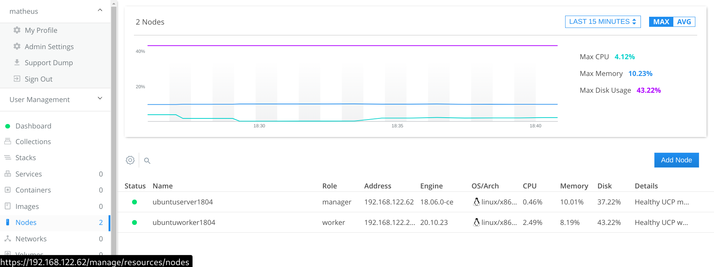
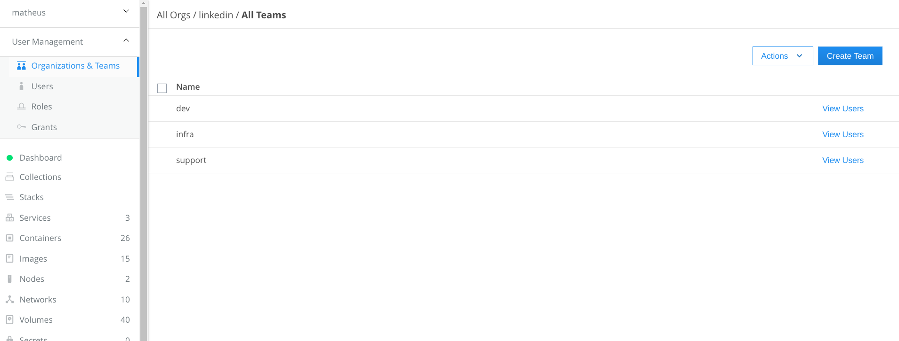
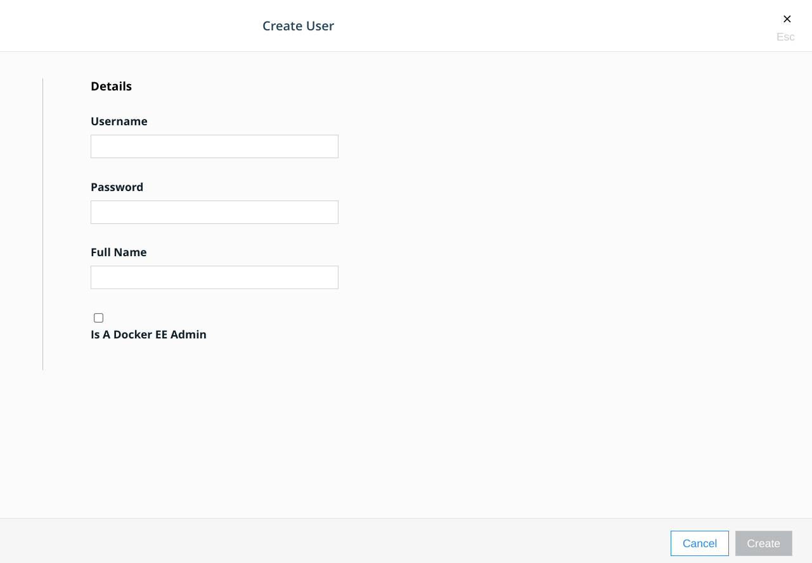
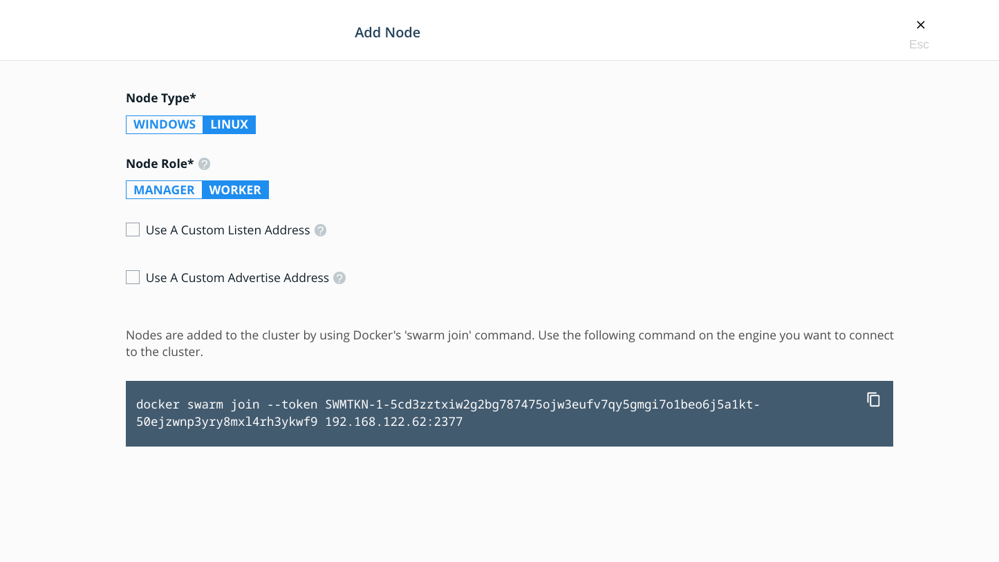

# Configuration

## Universal Control Plane (UCP)

The UCP is the centralized management tool for a Docker Enterprise Infrastructure. It is possible to run it into the Docker Community version of the Engine, but  with limited features.

To set up UCP we actually deploy it in Docker itself, which makes it pretty easy.

Command to install/run the UCP:
```
docker containter run --rm -it --name ucp -v /var/run/docker.sock:/var/run/docker.sock docker/ucp install --interactive
```

After that, it will ask you to create the admin user and password. Just for testing we don't need additional aliases.

After it completes it will show the URL to be able to reach the UCP.



### Users and Teams management

The UCP offers multi-user management and Role Based Access Control (RBAC). With that feature, we can add Organizations, Teams and Users, and then assign roles to the Users.





## Docker Swarm

Docker Swarm is a cluster management and orchestration feature that comes built into the Docker Engine. It creates `manager nodes` that are highly available and reliable to ensure that the high availability, orchestration, and UCP are always available. This way, if a `worker node` has a failure, the app that was running inside containers in that node would be restarted in another `worker node` in the Swarm cluster

In the UCP we can add more nodes to the Swarm cluster, either manager or worker nodes.

